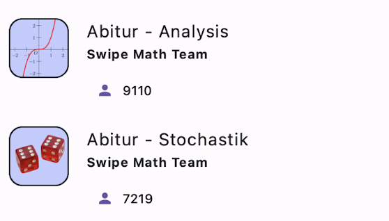

# SwipeMath für die Schule

SwipeMath ist perfekt dafür geeignet, auf die individuellen Stärken und Schwächen der Schüler:innen einzugehen, da unsere KI die Stärken und Schwächen der Schüler:innen erkennt, und dann individuell die richtigen Aufgaben und Erklärungen liefert. Wir haben aktuell zwei Angebote im Schulkontext: **bundeslandspezifische Abitur/Matura-Trainer** zum Selbststudium, sowie **klassenspezifische Kurse**, die wir auf Anfrage von Lehrer:innen gerne kostenfrei erstellen!

## Bundeslandspezifische Abitur/Matura-Trainer

Wir bieten kostenlose KI-Trainer für den Stochastik, sowie den Analysis Teil des Abiturs an.

Dabei kannst du aus den 16 Bundesländern genau deins aussuchen!

## Klassenspezifische Kurse

Wenn Sie Lehrperson an einer Deutschsprachigen Schule sind, freuen wir uns, für Ihre Klasse einen Kurs zu erstellen, der sich genau nach ihren Lehrinhalten richtet. Schreiben Sie uns dafür einfach eine [Mail](mailto:friedrich@sophiaedulabs.com), in der Sie ihre Schule, Klasse, sowie die von Ihnen gewünschten Inhalte nennen. Wir freuen uns, von Ihnen zu hören!
