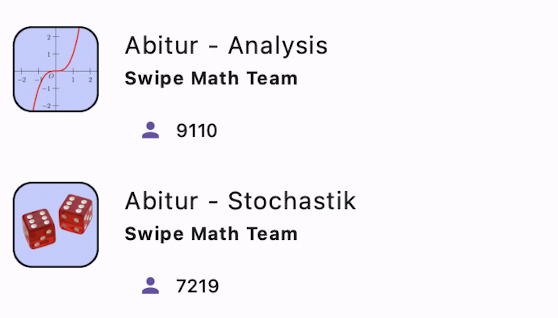
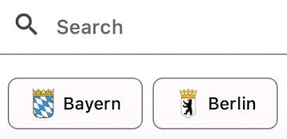

# SwipeMath for Schools

SwipeMath is perfectly suited to cater to the individual strengths and weaknesses of students. Our AI recognizes the strengths and weaknesses of the students and then individually provides the right tasks and explanations. We currently have two offerings in the school context: **state-specific Abitur / Matura Courses** for self-study and **Class-specific courses**, which we are happy to create free of charge upon request from teachers!

## State-Specific Abitur / Matura Course

  
We offer <b>free AI-powered courses</b> for the <a href="https://app.sophiaedulabs.com/focusai/stochastic_abitur"><b>stochastics</b></a> and <a href="https://app.sophiaedulabs.com/focusai/analysis_abitur"><b>calculus</b></a> parts of the Abitur.

  

---

  
You can choose exactly <b>your state</b> from the 16 federal states!

  

## Class-Specific Courses

If you are a teacher at a German-speaking school, we would be **happy** to create a course **for your class** that is tailored exactly to **your teaching content**. Simply send us an Email by clicking here: **[E-Mail](mailto:friedrich@sophiaedulabs.com?subject=Class-Specific%20Course%20Request)** stating your school, class, and the content you would like to have. We look forward to hearing from you!

